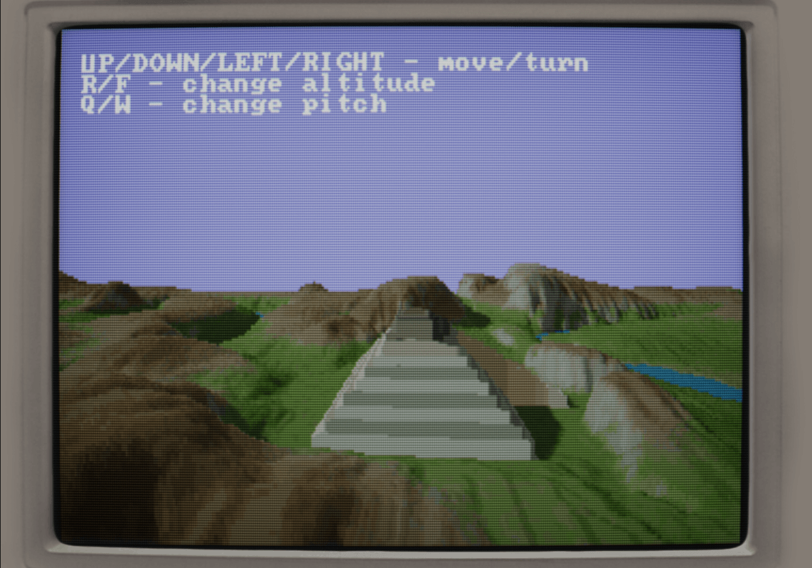

# zig-dos-like-voxel :floppy_disk:

Getting the [voxel](https://github.com/mattiasgustavsson/dos-like/blob/main/source/voxel.c)
example from [dos-like](https://github.com/mattiasgustavsson/dos-like) to build in
[Zig](https://ziglang.org/) :zap:

> [!Note]
> `zig translate-c -lc voxel.c > voxel.zig` was used as a starting point of the port.
>
> Most of the time was spent figuring out how to setup the build :joy:

## Map

Color                 | Height
----------------------|--------------------
 | 

These images are used for the voxel effect.

## Requirements

A fairly recent version of [Zig master](https://ziglang.org/download/#release-master)
(which would be `0.15.0-dev.769` when this was written)

 - `SDL2`
 - `GLEW`
 - `pthread`

## Compilation

You should hopefully be able to compile the binary by calling `zig build`

> [!Note]
> As a convenience you can compile and run the binary via `zig build run`
> (or `zig build run -- -w` if you want to start in windowed mode)

## Links

 - https://mattiasgustavsson.itch.io/dos-like
 - https://github.com/s-macke/VoxelSpace
 - https://ziglang.org/
